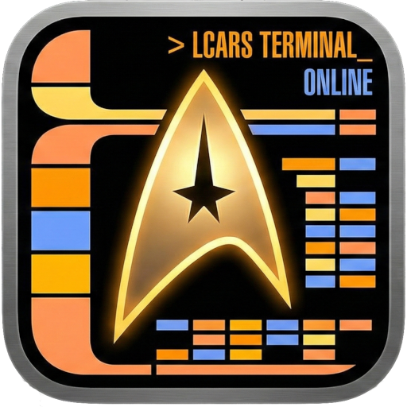

# LCARS Terminal

A fully functional, Star Trek-inspired terminal emulator for Linux, featuring the iconic LCARS (Library Computer Access and Retrieval System) interface. Built with Electron, xterm.js, and node-pty.

This version (2.0.0+) includes a fully offline, privacy-focused **Voice Assistant** capable of system control, media playback, and conversational interactions using customizable personalities.



## Features

- **Authentic LCARS Interface**: Immersive UI styled after the 24th-century operating system.
- **Offline Voice Assistant**:
  - **Privacy First**: No audio is sent to the cloud. Uses **Vosk** for speech recognition and **Piper** for neural text-to-speech.
  - **Wake-Word Free**: Just speak naturally. The assistant listens for its name (e.g., "Computer", "Leo") in your sentence.
  - **Customizable Personalities**: Switch between "Computer", "Leo", "Dalek", "GLaDOS", and more.
- **Multiple Tabs**: Manage multiple terminal sessions simultaneously.
- **Global Hotkeys**: Toggle visibility (`F8`) or cycle monitors (`F9`) from anywhere in the OS.
- **Session Restoration**: Automatically restores your open tabs and working directories.
- **User Configuration**: All settings, voices, and personalities are stored in `~/.config/lcars-terminal` for easy backup and customization.

## Installation

### AppImage (Recommended)

1. Download the latest `.AppImage` file from the [Releases](../../releases) page.
2. Make the file executable:
   ```bash
   chmod +x "LCARS Terminal-2.0.0.AppImage"
   ```
3. Run it:
   ```bash
   ./"LCARS Terminal-2.0.0.AppImage"
   ```

*Note: On the first run, the application will populate `~/.config/lcars-terminal` with default voices, personalities, and settings.*

### From Source

1. Clone the repository:
   ```bash
   git clone https://github.com/yourusername/lcarsterm.git
   cd lcarsterm
   ```
2. Install dependencies:
   ```bash
   npm install
   ```
3. Run the application:
   ```bash
   npm start
   ```

## Voice Assistant Guide

The LCARS Terminal comes with a built-in voice assistant that runs entirely locally on your machine.

### Basic Usage
1. Click **CONFIG** in the sidebar.
2. Toggle **ENABLE VOICE COMMANDS**.
3. Speak a command addressing the assistant. The default name is **Computer**.

**Example Commands:**
- *"Computer, status report."*
- *"Computer, what time is it?"*
- *"Computer, what is the weather?"* (Requires configuring location in settings)
- *"Computer, system mute."*
- *"Computer, say hello."*

### Configuration
All configuration is managed via the **CONFIG** panel in the app, or by directly editing files in `~/.config/lcars-terminal/`.

- **Assistant Name**: The name the AI listens for (e.g., "Computer", "Jarvis").
- **Phonetic Alternatives**: Helps if the AI struggles to hear the name (e.g., "Helio" for "Leo").
- **Voice Model**: Select the voice used for responses.
- **Personality**: Defines the specific phrases and attitude of the assistant.

### Adding New Voices
The assistant uses **Piper** neural voices (`.onnx` format).
1. Download a voice from [Piper Voices](https://github.com/rhasspy/piper/blob/master/VOICES.md).
2. You need the `.onnx` file and the `.onnx.json` config file.
3. Create a folder in `~/.config/lcars-terminal/voices/` (e.g., `MyNewVoice`).
4. Place both files inside that folder.
5. Restart LCARS Terminal or click "Reload" in settings.

### Customizing Personalities
Personalities are JSON files stored in `~/.config/lcars-terminal/personalities/`. You can create your own to change how the assistant speaks.

**Example `custom.json`:**
```json
{
    "name": "My Custom Personality",
    "introductions": [
        "Systems online.",
        "Ready for input."
    ],
    "shutdown_phrases": [
        "Powering down.",
        "Goodbye."
    ],
    "restart_phrases": [
        "Rebooting system.",
        "Cycling power."
    ]
}
```

### Customizing Commands
Voice commands are defined in `~/.config/lcars-terminal/commands.json`.
The format is `"Trigger Phrase": "Shell Command"`.

- `{assistant_name}` is a placeholder for the name you configured (e.g., "Computer").
- `{base_dir}` is the path to the internal scripts folder.

**Example:**
```json
{
    "{assistant_name} open firefox": "firefox",
    "{assistant_name} list files": "ls -la",
    "good morning {assistant_name}": "{base_dir}/startup-briefing.sh"
}
```

## Advanced Usage

### Command Line Arguments
You can control the running instance of LCARS Terminal using command line arguments.

| Argument | Description |
|----------|-------------|
| `--new-tab [path]` | Open a new tab. Optionally specify the working directory. |
| `--title "Name"` | Set the title for the new tab. |
| `--execute "cmd"` | Execute a command in the new tab immediately. |
| `--close "Name"` | Close any existing tab with the specified title. |

#### Example: External Control
```bash
# Open a new tab named "Server Log" and tail a file
./LCARS\ Terminal.AppImage --new-tab --title="Server Log" --execute="tail -f /var/log/syslog"
```

## Development

To build the AppImage yourself:

```bash
npm run dist
```
The output will be in the `dist/` directory.

## License

[MIT](LICENSE)
